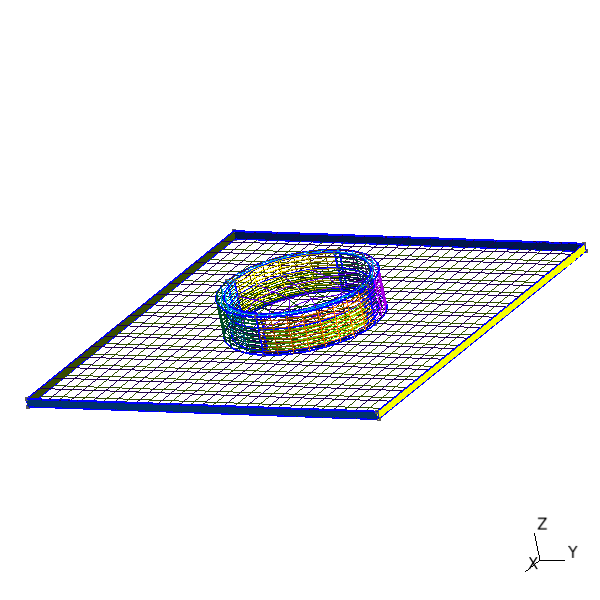
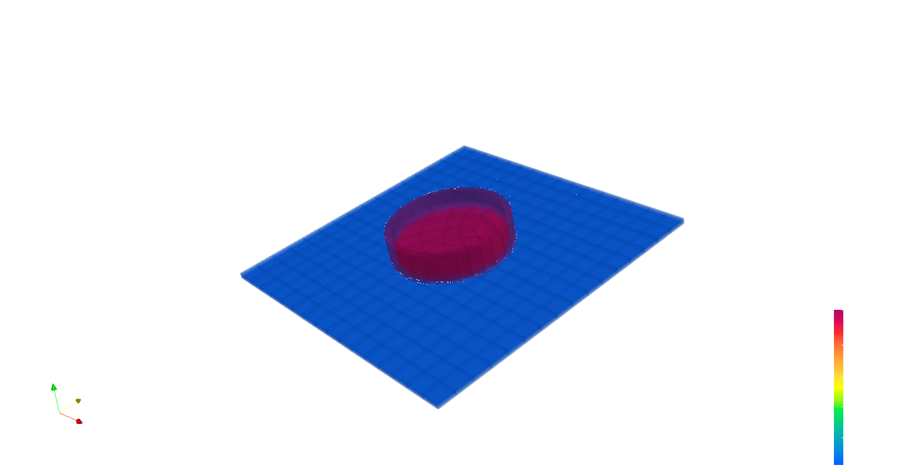

# thesis\_fea
My thesis FEM analysis

## build

### requirements.
-   [deal.ii](https://www.dealii.org)
-   [gmsh](https://gmsh.info) for modify mesh
-   [paraview](https://paraview.org) to post process and visualize data

### compiling
deal.ii is available only under Linux.

On Ubuntu there is an already packaged binary, otherwise you'll have to build
it from sources.

The best solution in my opinion to use it under Windows is use the dealii
Docker [container] (https://hub.docker.com/r/dealii/dealii). The Dockerfile and
the powershell script in this repository are build upon it and provide a base
environment for developing on it.

To create the image of the container run in the folder where the dockerfile is
```console
docker build -t dealii .
```

the to create an image run in a powershell console
```console
./run.ps1 docker_create SHARED-DIR
```
and to run it 
```console
./run.ps1 docker_start
```

the image will provide a shared folder named ___shared___ int the home folder
linked with the [SHARED-DIR] you've provided.

the to build the executable run
```pwsh
./run.ps1 build
```

## results

### gmsh mesh
the mesh



the solution for laplace equation


